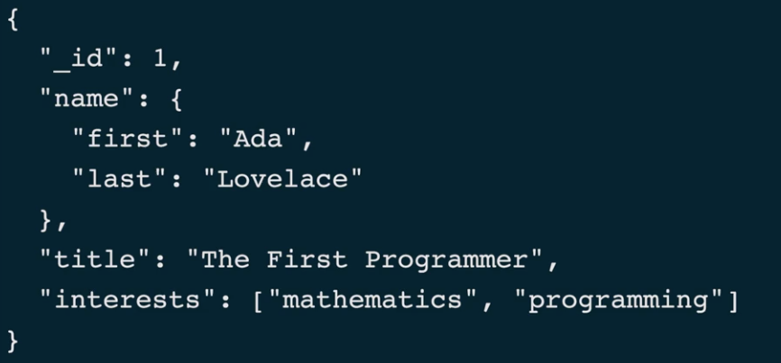
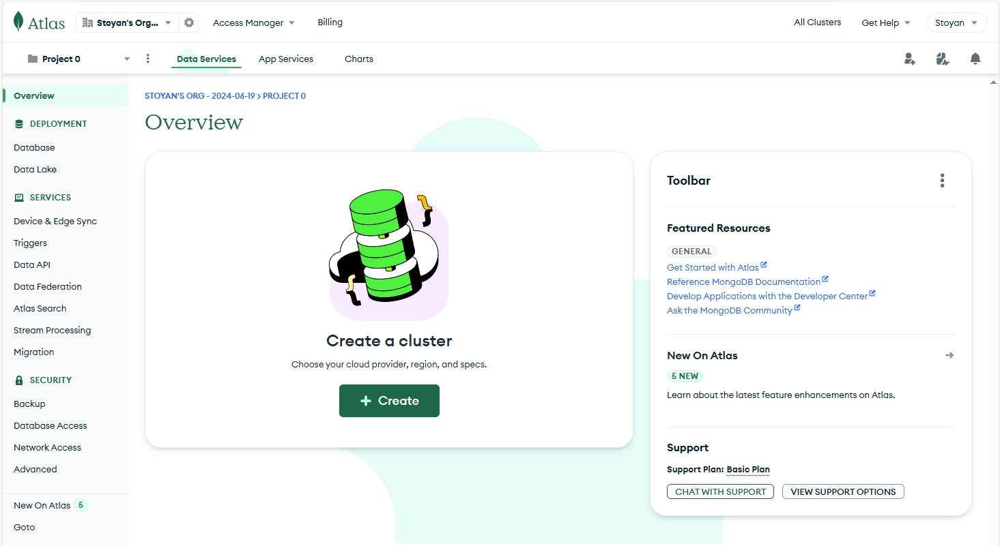
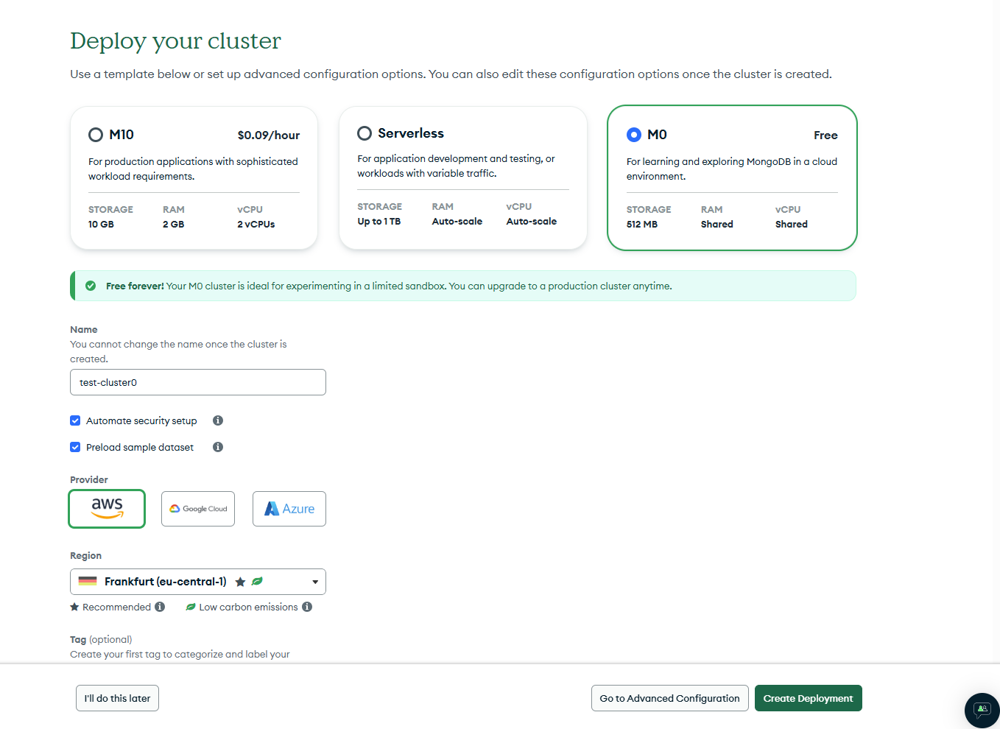
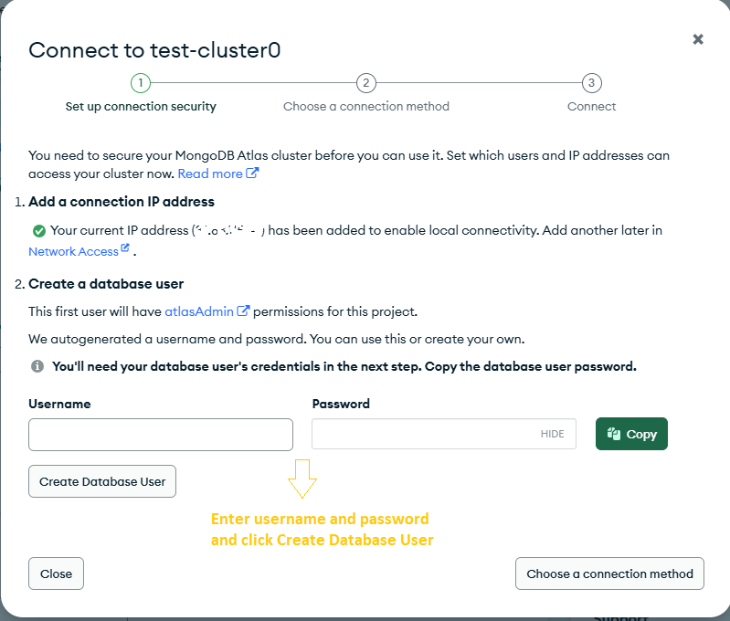

###  Какво е MongoDB и как данните са организирани в нея?
MongoDB е нерелационна(NoSQL) база от данни с общо приложение подходяща както за малки така и за големи проекти 
от различно естество: e-commerce, content management, IoT, trading and payments,gaming,real-time analytics,etc.
Данните в нея се съхраняват в структури наречени документи.
Document-ът e базова единица от данни в mongo и наподобява JSON обект.
Document-ите в монго се изобразяват в JSON формат, но в базата се съхраняват в BSON формат.
BSON(binary json) е extension на JSON като поддържа допълни data типове като Dates, Numbers(double, 32-bit/64-bit integers,decimal128), Object ID's и др.

Синтаксис:

    {
        "key": value,
        "key": value,
        "key" : value
    }

Документите се пазят в колекции.
Колекциите се пазят в databases.
Database-ите се пазят в cluster-и.

Документите могат да репрезентират данни с различна структура: key-value pairs,text, geospatial indexes, time-series, graph data, etc.

###  Кога бихме използвали MongoDB?
MongoDB не изисква данните да следват определена schema ,което прави базата подходяща за съхранение на данни 
с променлива структура и за проекти с често променящ се data model. Иначе казано, 
можем да имаме документи с различни полета в рамките на една колекция.
Ако често добавяме нови полета в нашият data model монго е добро решение.
При необходимост можем да добавим ограничения върху структурата на документите в дадена колекция.
Практичеки пример е съхраняването на log записи.

###  Кои са основните типове от данни поддържани в MongoDB?
JSON data types: string, object, array, boolean ,null

BSON data types: JSON data types + Dates, Numbers, Object ID's

ObjectId е data type за създаване на уникални id-та.
Всеки документ трябва да има _id поле, което играе ролята на primary key.Ако _id не се подаде при създаване на 
документа, mongo автоматично генерира такова от ObjectId тип.

###  В какво се изразява полиморфизмът в MongoDB?
Едно и също поле в два документа,част от дадена колекция, може да е от различен тип.(За разлика от релационните 
бази,в които схемата се дефинира при създаването на таблицата)

###  Каква е разликата между MongoDB и релационните бази от данни?
Документите в една колекция могат да имат различна структура тъй като схемата в монго е гъвкава, докато схемата в релационните
бази се дефинира при създаването на таблица.

###  Какво е MongoDB Atlas?
Платформа предлагаща Cloud hosted database instances + GUI(Atlas Data Explorer) за взаимодействие с базата, 
аналогично на MongoDB Compass.

 TODO Connect to atlas cluster with MongoDB Compass: 
 TODO Connect to atlas cluster with mongo shell: 

###  Стартирай MongoDB в docker контейнер

    > docker pull mongo
    > docker run --name some-mongo -p 27017:27017 -d mongo:latest
    > docker exec -it some-mongo /bin/bash
        root@5734553:/# mongosh
        test> show dbs
        test> db.help()     //show commonly used commands