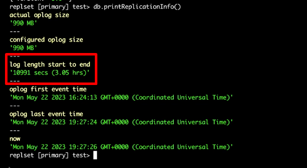
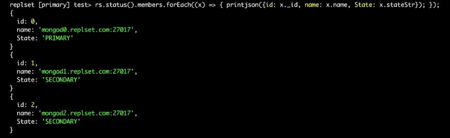
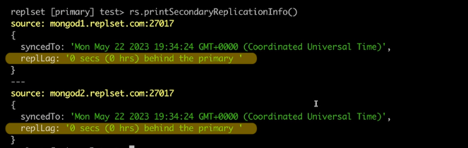
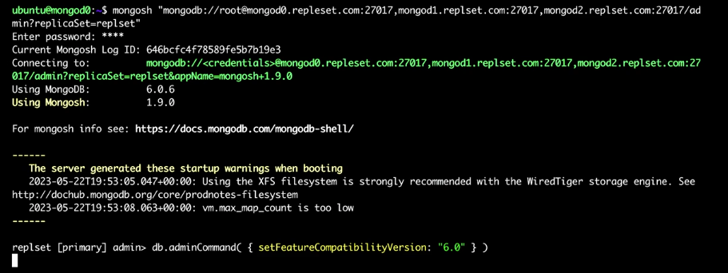
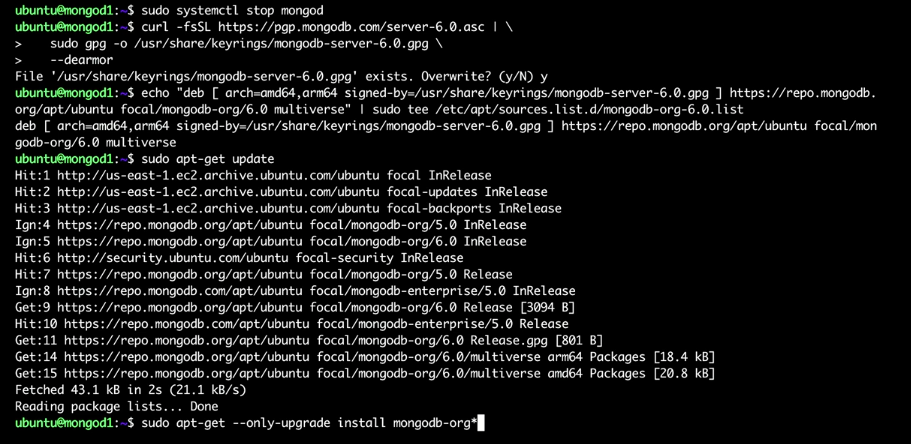
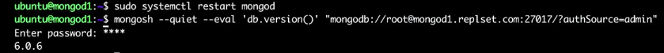
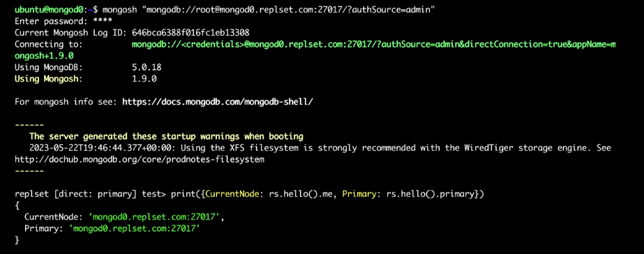
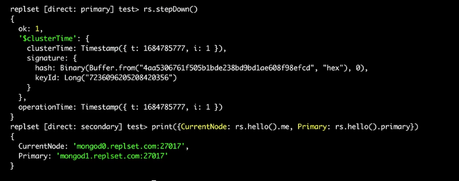

You don't have to give up high availability when you are performing maintenance in MongoDB.

### <span style="color:darkgoldenrod"> When maintenance is required?
   - Upgrading mongodb version
   - Upgrading drivers
   - Security updates to the OS
   - Changes to replica set membership
   - Upgrading OS
   - Creating a new index ?(Creating a new index on a replica set or sharded cluster requires it to be built on each node in a rolling fashion.)

### <span style="color:darkgoldenrod"> How to perform maintenance without losing high availability for users?
Mongo минимизира downtime-a чрез т.нар. rolling maintenance.
Ако имаме replica set от 3 node-a, спираме един ,ъпдейтваме го и го стартираме отново.Повтаряме процедурата и за останалите.
Така във всеки момент базата продължава да работи.

Преди upgrade:
- ако инстлирате версия 6.0 се уверете,че настоящата е 5.0 (не трябва да се прескачат версии)
```mongosh --quiet --eval 'db.version()'```
- проветете compatibility таблиците за съвместимост(м/у mongodb и mongo driver-a за app-a)
- проверете колко време имаме да извършим upgrade-a на даден node на база oplog прозореца(разликата между най-старите и последните опрации в oplog-a),за да избегнем full resync
  
- проверете,че съответния node e healthy (не е в rollback или recovery state)
  
- проверете,че secondary node-овете не се опитват да catch up-нат предишни event-и(че няма replication lag)
  

По време на upgrade:
- заменяме старите binaries с новите (например 5.0 -> 6.0)
- тестваме апп-а с 6.0 бинарките и FCV(feature compatibility version) сетнато на 5.0
- ако всичко е ок сетваме FCV на 6.0 by connecting to mongodb replica set and running ```db.adminCommand({setFeatureCompatibilityVersion: "6.0"})```
 
Before upgrading, you should confirm that each member of the replica set has the same feature compatibility version. The feature compatibility version enables or disables the features that persist data and are incompatible with earlier versions of MongoDB.


Пример:
- логваме се на secondary node 
- спираме mongod сървиса ```sudo systemctl stop mongod```
- импортваме gpg keys
- създаваме list файл за 6.0 package репозиторито
- reload local package database ```sudo apt-get update```
- инсталирайте последната версия ```sudo apt-get install --only-upgrade install mongodb-org*```
- рестартирайте mongod сървиса ```sudo systemctl restart mongod```
- потвърдете,че версията е ъпдейтната
- изчакайте докато secondary node-a catch up-не с останалите node-ве от cluster-a
- повторете горните стъпки за останалите secondary node-ве
  
  
- логваме се на primary node-a
- потвърждаме,че node-a в действителност е primary node-a
  
- стартираме election за нов primary node ```rs.stepDown()```
- изчакваме няколко секунди преди да потвърдим ,че primary node-a е сменен
  

Upgrade-ването може да подобри или да влоши performance-a.Тествайте преди push на production.

The server API option enables the Stable API feature. When you use Stable API feature with an official MongoDB driver you can update mongodb version and be sure that it won't brake your app.

### <span style="color:darkgoldenrod">  Retrieve the current version of MongoDB
```mongosh --quiet --eval 'db.version()'```

Пример за rolling maintenance при създаване на индекс:
Индексът се създава последователно на всеки член от replica set-a,за да се избегне downtime

  1.connect to secondary node

    db.getMongo().setReadPref('secondary');
    rs.secondaryOk();
    rs.freeze(1200);  // Freeze for 20 minutes (1200 seconds)
    db.collection.createIndex({ yourField: 1 });
    rs.freeze(0);  // Unfreeze

    db.currentOp({ "msg": /Index Build/ }); //monitor the progress of the index creation

    db.getSiblingDB('admin').runCommand({ listIndexes: "yourCollection" }); //Ensure Cluster-Wide Index Creation

To avoid breaking your application, you should ensure that the MongoDB version is compatible with the MongoDB driver that you plan to use.


