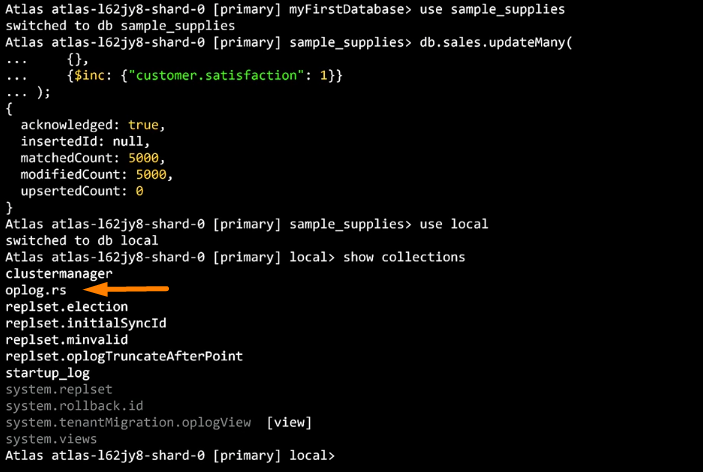
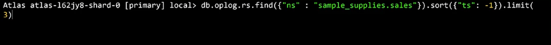
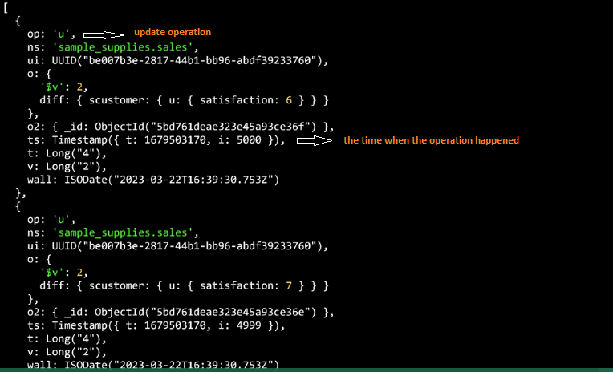
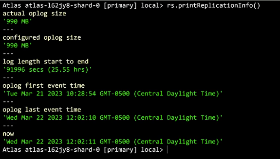
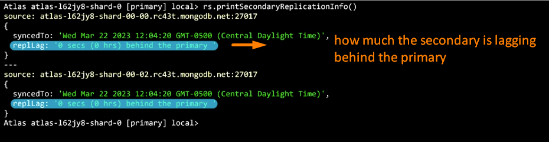
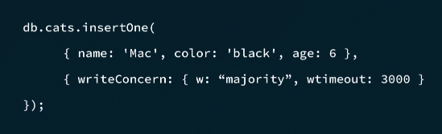
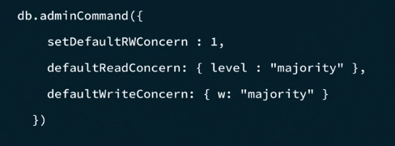
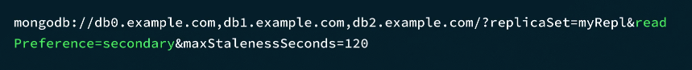
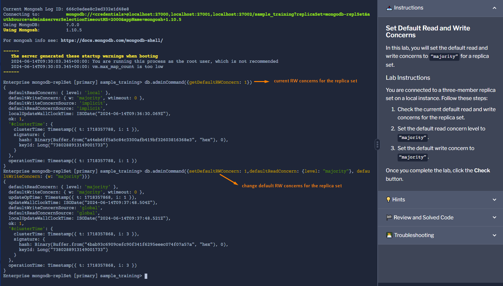

### <span style="color:darkgoldenrod"> Какво наричаме replication?
<span style="color:orange">replication</span> е процесът по съхраняване на множество копия от данни върху няколко сървъра, поддържайки отделните копия синхронизирани
Групата от сървъри участващи в replication процеса формират <span style="color:orange">replica set</span> .
Всяка mongod инстанция в replica set се нарична <span style="color:orange">replica member</span>.
Чрез replica set-a постигаме fault tolerance, high availability и data durability.

The secondary is responsible for replicating the data from the primary. The secondary does this by duplicating the primary's oplog entries and applying the operations to their datasets. As a result, the secondaries' datasets reflect the primary's dataset.

### <span style="color:darkgoldenrod"> Какво наричаме automatic failover?
Ако primary node-a падне, автоматично се избира secondary node, който да заеме мястото му.(чрез election)

<span style="color:orange">High availability</span> - данните в базата са достъпни дори в случай на failures и maintenance.В монго това се постига чрез automatic failover.Ако primery node-a падне, автоматично се избира secondary node, който да заеме мястото му.В случай на maintenance HA се постига чрез rolling maintenance - ъпдейтване на нодовете един по един.

<span style="color:orange">Fault tolerance</span> - системата не губи данни в случай на hardware failures и други проблеми.В монго това се постига чрез поддържането на множество копия на данните сред node-овете в replication set-a.

<span style="color:orange">Data durability</span> - изразява се в това ,че веднъж когато write операция бъде acknowledged, данните няма да бъдат загубени в случай на system failure. Това се постига благодарение на replication set-a ,тъй като една write операция е acknowledged когат бъде записана на primary node-a и поне на един secondary node,в зависимост от write concern конфигурацията.

MongoDB replica set обичайно се състои от 3,5 или 7 members/mongod инстанции.(50 max, 7 max voting)

<span style="color:orange">node</span> - сървър, на който върви mongod инстанция

replica set се състои от един <span style="color:orange">primary node</span> и множество <span style="color:orange">secondary node</span>-ове. Primary node-a е единствения, който приема write операции.След като write операция бъде изпълнена на primary node-a ,тя се записва в неговия <span style="color:orange">oplog</span>(operation log), откъдето secondary node-овете репликират операциите и ги изпълняват.По default primary node-a приема и всички read операции,но това поведение може да се промени така че secondary node също да приема read заявки.
Ако primary node-a не е responding се инициира <span style="color:orange"> election</span>, процес който определя нов primary member. 
Когато nonresponsive node-a отново започне да функционира той се включва като secondary node-e в replica set-a и наваксва прилагайки изпуснатите операции по време на отсъствието си. 

<span style="color:orange">failover</span> - процесът по избиране на нов primary node-a (election), когато съществуващият стане unavailable и възстановяване на нормалния работен процес с новия primary node

### <span style="color:darkgoldenrod"> Кога настъпва election?
- когато primary node-a стаме unresponsive
- при създаване на replica set
- при добавянето на нов node към replica set-a
- rs.stepDown()
- rs.config()
- ако secondary node-овете загубят връзка с primary node-a за повече от конф. timeout (10s default)

An election in MongoDB does not always lead to a change of the primary node

### <span style="color:darkgoldenrod"> Как протича election?
The secondary that initiated the elections shares how recent its data is and shares the election term, which is a count to track the number of elections.It votes for itself.
Odd number of voting members гарантира избирането на primary member в случай на network partition(?)
Всеки replica set член има priority value, което индикира eligibility на члена да стане primary.По default е 1 за всеки secondary. За да направим някой член по-eligible можем да му дадем стойност между 0 и 1000.
Член с priority value 0 не може да стане primary и да инициира election.
Ако имаме предпочитания към даден член(поради локацията например) можем да му зададем 99 priority value,а на другите членове по 50. Това гарантира ,че първият член винаги ще печели изборите ако е "up to date" member.Ако този член стане unresponsive някой друг ще бъде избран за primary ,докато първоначалния не стане отново достъпен и предизвика нови избори, след като е репликирал липсващата си data.
Всеки член гласува за този с най-голям приоритет.Election процеса отнема секунди.

By default, a three-member replica set has three voting members.

### <span style="color:darkgoldenrod">Какво е oplog?
oplog е колекция, която пази последните write операции изпълнени върху инстанцията.
Тя е с фиксиран размер (5% of available space,max 50GB), 
като момента ,в който се запълни най-старите записи се презаписват с нови.

secondary node-овете pull-ват oplog entry-тата на primary node-a и прилагат същите
операции в същия ред.





If ```db.sales.updateMany()``` updated 5000 docs we will have 5000 entries in the oplog.

```db.sales.updateMany()``` === ```db.sales.updateOne(...) x 5000```



Можем да възстановим базата до даден момент в oplog-a.

```rs.printReplicationInfo()``` - връща информация за oplog-a,като размер и oplog window



<span style="color:darkgoldenrod">oplog window</span> - времето в което трябва да се вместим по време на maintenance ако искаме да избегнем initial sync(копиране на цялата data заедно с oplog-a от друг член в replication set-a)

Чрез  ```rs.printSecondaryReplicationInfo()``` командата можем да видим lag-ът между primary и secondary нодовете:



Причини за replication lag : network latency, disk throughput, long-running operations, not having the appropriate write concerns

Ако sеcondary node изостане прекалено много от primary node-a ще влезе в RECOVERING state.
В този state може да гласува,но не и да приема read операции. 
За бъде отново up to date, трябва да бъде стартиран initial sync.
Той включва копирането на всички данни и oplog-a от друг член на replica set-a.
Initial sync-a е expensive откъм ресурси.

standalone mongodb инсталации нямат oplog

### <span style="color:darkgoldenrod">Какво са read и write concerns в MongoDB?
Write concern описва колко члена в replica set трябва да acknowledge-нат write операция,за да бъде счетена за completed.
По-високо ниво на acknowledgment = stronger durability.

write concern опции:
- majority - мнозиство от членове трябва да acnknowledge write операцията,за да бъде приета за успешна
- \<number> - write concern of 1 изисква само primary node-a да признае write операцията

  
    db.users.insertOne({ name: 'Jade', age: 20, "last_updated": new Date() }, { writeConcern: { w: 1 } })

    db.collection.find().readConcern("majority") //used for critical read operations where data consistency is crucial

Default-ните write concern e w:1 ,който изисква acknowledgement само от primary node-a.
Default-ния read concern e "local", data-та се чете само от node-a към който е насочена заявката и не се гарантира, че 
е acknowledged-ната от друг node.
### <span style="color:darkgoldenrod">Как да конфигурираме write concern?
Директно в операцията:


- wtimeout гарантира ,че операцията няма да бъде блокирана indefinitely

Read concerns: 
- local(default) - returns the most recent data
- available -same as local but for replica sets
- majority - returns only data that is acknowledged as written by a majority of members in a replica set
- linearizable - return all successfull,majority ackn. writes that completed before the start of the read

majority acknowledged data is durable data

Change read and write concerns for all users:
-connect to admin database and run:


-setDefaultRWConcern is the name of the admin command we are calling

### <span style="color:darkgoldenrod">Какво е read preference?
read preference посочва членовете от които искаме да четем.По default read preference е primary.

primaryPreferred - goes to secondary if primary is not available

secondary - read from secondaries

secondaryPreferred - read from primary if secondaries are not available

nearest - чете от най-близкия член в мрежата

четенето от secondary крие възможността от това да получим stale data


Четем от secondary, който е maximum 120 секунди назад

### <span style="color:darkgoldenrod">Каква е разликата между read concern и read preference?
Read concern lets your application specify a durability guarantee for the documents that are returned by a read operation.

Read preference allows you to determine from which replica set members read operations will be read from. 

Get and set replica set RW concerns:



### <span style="color:darkgoldenrod">How to deploy 3 member replica set?

1.Provision 3 separate Ubuntu servers

2.Open firewall between those 3 servers so they can communicate with each other

3.Install mongodb on the servers

4.Each server has DNS record like mongod0.replset.com,mongod1.replset.com,mongod2.replset.com 
associated with the respective non-local IP address

5.Before we deploy replica set we need to secure our servers by creating a shared password file
known as a key file on the server, that each server will use to authenticate with one another.In production we 
would prefer something like an x509 certificate instead of just a key file.

```~$ openssl rand -base64 756 > /tmp/keyfile``` - generate base64 file

Copy the generated file from mongod0 server to the other 2.

    ~$ scp /tmp/keyfile mongod1.replset.com:/tmp
    ~$ scp /tmp/keyfile mongod2.replset.com:/tmp

...LESSON 6: DEPLOYING A REPLICA SET IN A MONGODB DEPLOYMENT 2:30

//rs.initiate() is used to create a replica set.

...LESSON 7: CONFIGURING A REPLICA SET IN A MONGODB DEPLOYMENT

By default, a three-member replica set has three voting members.

Not having the appropriate write concerns can cause replication lag. If you are performing a large data ingestion or bulk load operation that requires a large number of writes to the primary, particularly unacknowledged writes, the secondaries will not be able to read the oplog fast enough to keep up with changes.
