authentication - the process of identifying the user trying to access the database

create login credentials for users that need to connect to db

common auth mechanism - prompt for username and password

auth can be managed by the db itself or through integration with organization identity mgmt system

authorization - процесът по верифициране ,че даден user има права да изпълни определена операция

RBAC(role-based access control) - authorization approach, where permissions are granted to roles rather than to users.
Then users are granted one or more roles.

auditing - logging the changes made to the data and db configuration,as well as security incidents.Add overhead to the system.

Auditing is often needed to comply with regulatory requirements.For example, regulations in some industries require organizations to keep an audit trail of database actions such as user authentication and authorization events.

Default auth mechanism in MongoDB is SCRAM (salted challenge response authentication mechanism)

Как да създадем user в mongo using SCRAM?
1.mongod process is started and mongosh is installed
2.Enable access control from conf file to enforce authentication
```sudo vi /etc/mongod.conf```

    #security
    security:
        authorization: enabled

```sudo systemctl restart mongod```

3.Connect to mongod with ```mongosh```. Успяваме благодарение на т.нар. localhost exception.
За да можем да създаваме user-и и да им добавяме роли първо трябва да създадем admin user-a в admin базата, като 
преди това трябва да enabled-нем access control-a.
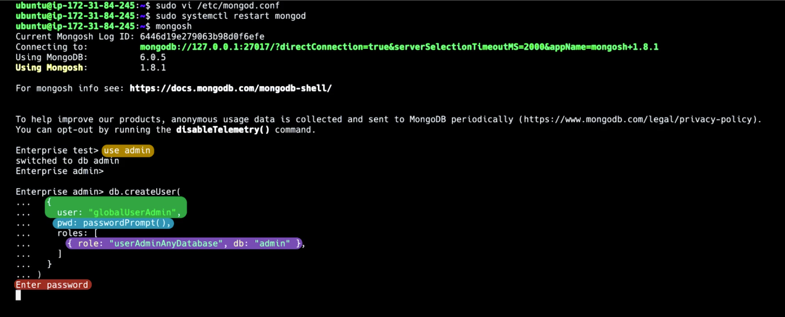

userAdminAnyDatabase - вградена super user роля, която позволява на user-a да създава и модифицира user-и и роли
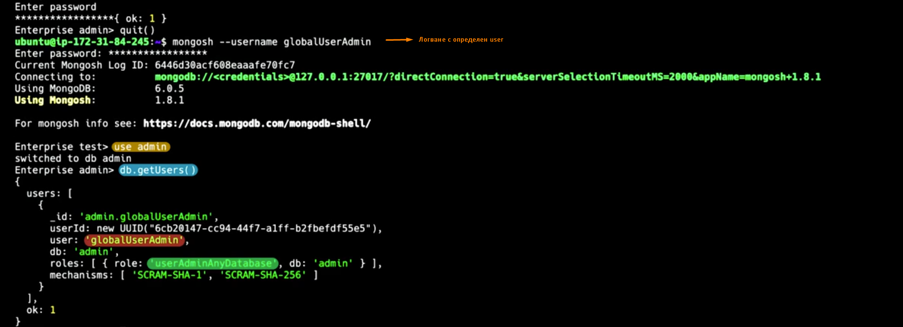

Localhost exception - позволява да се свържем с localhost без аутентикация стига все още да не са създадени user-и и роли

### <span style="color:darkgoldenrod">Настройване на authorization чрез Role Based Access Control.
Добавяне на роля към потребител при неговото създаване:
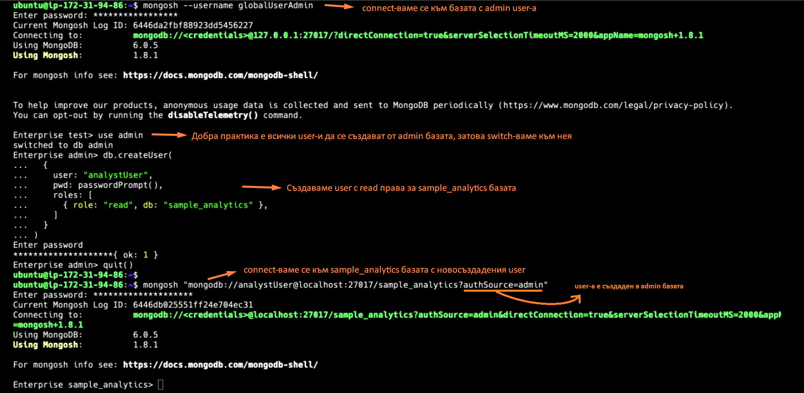
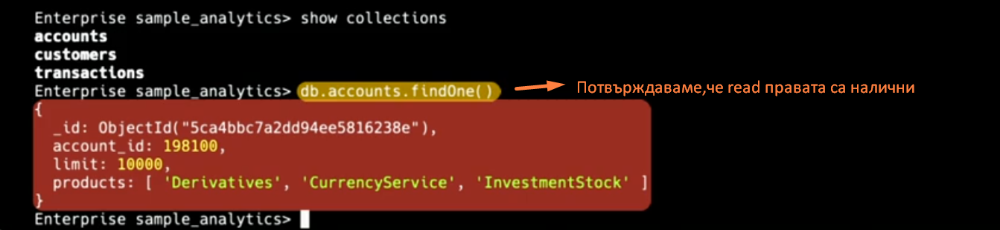

Изтриване роля на потребител:
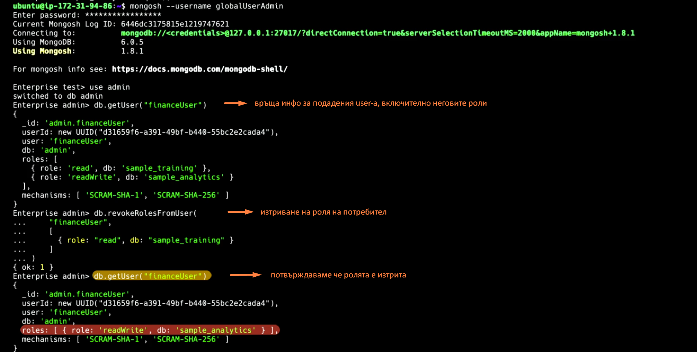

Example built-in roles:
- db user roles:read,readWrite
- db admin roles: dbAdmin, dbOwner
- all-db roles: readAnyDatabase, userAdminAnyDatabase

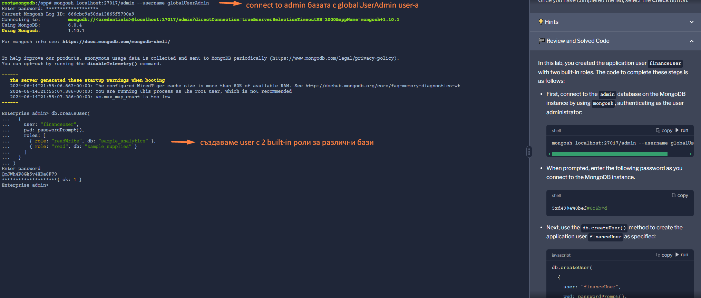

### <span style="color:darkgoldenrod">Как да актвираме auditing?
- Добавяйки --auditDestination опцията при стартиране на mongod.
- Сетвайки auditLog.destination опцията в config файла.

Можем да записваме audit event-и в:
- syslog-a в JSON формат (не е налична на Windows)
- конзолата в JSON формат
- файл в JSON или BSON формат


    auditLog:
        destination: file
        format: JSON
        path: /var/log/mongodb/auditLog.json

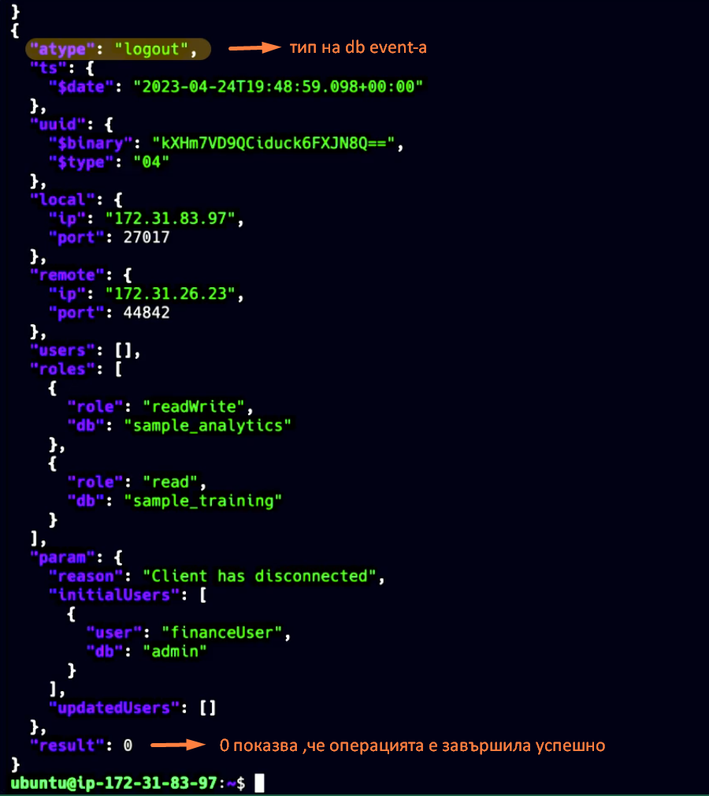

### <span style="color:darkgoldenrod">Какво е encryption?
Encoding data to ensure only permitted users can read it.

Encryption categories:
- <span style="color:orange">transport encryption(network encryption)</span> - данните предавани по мрежата са 
криптирани, което ги предпазва при потенциален interception(освен ако attacker-a няма съответните decryption 
ключове).<span style="color:orange">TLS(transport layer security)</span> е криптографски протокол осъществяващ transport encryption.
Mongo поддържа TLS за криптиране на комуникацията между клиентите и монго инстанциите(data in motion)
За да използва TLS, монго трябва да има валиден TLS сертификат(issued by certificate authority или self-signed cert),верифициращ identity-то на всеки от сървърите в replica set-a.
Always enable TLS.
В Atlas e enabled по default,в self-managed deployment-не.За да включум TLS-a трябва да имаме TLS сертификат в pim файл на всеки от сървърите в релика сета.

**Deploy 3 member replica set with TLS enabled:**

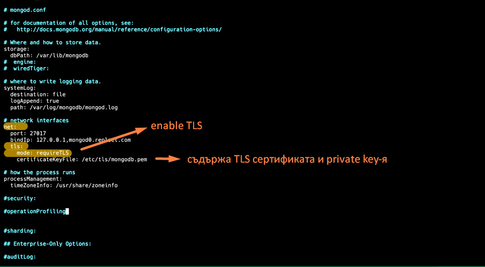
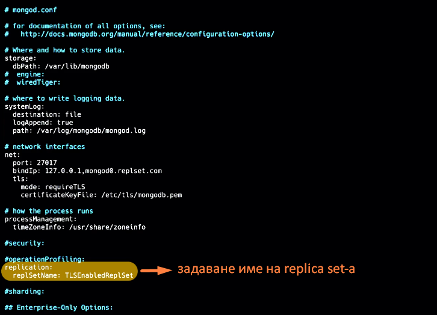
- Повтаряме същите стъпки за остналите сървъри от replice set-a
- Рестартираме mongod на всеки сървър:```sudo systemctl restart mongod```
- Създаваме (initiate) replica set-a:
  - connect-ваме се към mongod0 с connection string включващ следните TLS опции:
  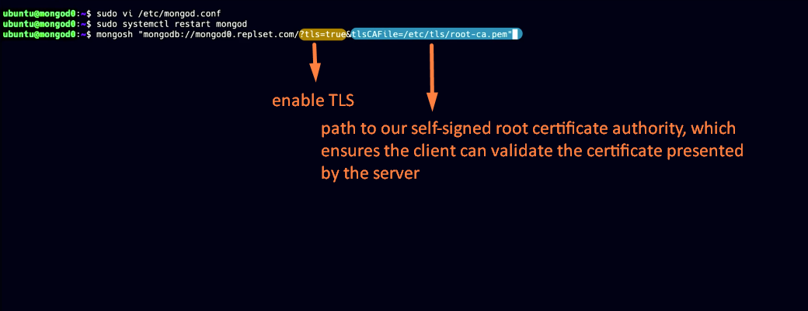
  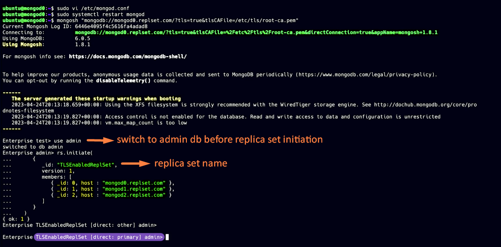
- Тестваме,че сме конфигурирали TLS успешно:
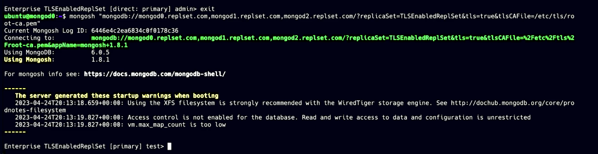
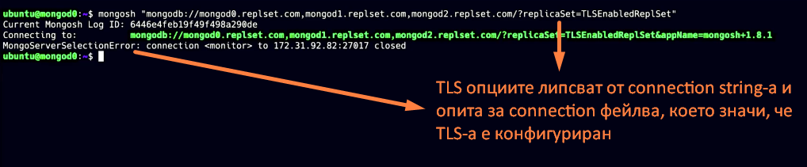

- <span style="color:orange">encryption at rest</span> - процесът по криптиране на данните в базата, заедно с backup копия-та.
Ако криптиращият данните ключ бъде изгубен или откраднат, данните могат да станат компреметирани или недостъпни.
Също encryption at rest не работи срещу вътрешни заплахи-от(insider attacks) вече оторизирани user-и.
Също не може да защити вече декриптираните данни по време на обработка в RAM паметта.
  <span style="color:orange">Encrypted Storage Engine</span>-а криптира data file-овете на диска, които могат да се декриптират само със съответния decryption ключ.Engine-a е наличен само за mongo enterprise.
File system and full disk encryption са external подходите за постигане на encryption at rest при отсъствието на Encrypted Storage Engine.

- <span style="color:orange">in-use encryption</span> - данните се криптират в app-a още преди да бъдат изпратени към базата и се декриптират, когато отново постъпят в app-a, така server-a работи само с криптирани данни.
Предпазва от insider attacks и в монго се постига със <span style="color:orange">CSFLE/ client-side field level encryption</span>. Така данните заредени в РАМ паммета също са криптирани.
Данните се криптират и декриптират в client app-a, server-a работи само с криптирани данни.
  <span style="color:orange">CSFLE осигурява in-use encryption, at rest encryption и transport encryption</span>
Със CSFLE можем да криптираме отделни полета в документ,преди да го изпратим по мрежата към базата.По този нячин те няма да бъдат expose-нати в plain text по време на query lifecycle-a.
В същото време client-a взима декриптиращи ключове от key management system-a.
CSFLE работи за community и enterprise, но community версия изисква ръчно настройване на encryption логиката в app-a с помощта на монгодб encryption библиотеката.
При enterprise имаме автоматично криптиране и декриптиране, като посочваме полетата за криптиране в JSON schema-та

Automatic encryption is a mechanism available in MongoDB Enterprise for setting up Client-Side Field Level Encryption (CSFLE). Automatic encryption enables you to perform encrypted read and write operations without having to write code to specify how to encrypt fields.

### <span style="color:darkgoldenrod">Инсталиране на replica set,който приема само кънекции криптирани с TLS?
Setting the net.tls.mode configuration file setting to requireTLS specifies that the server uses and accepts only TLS-encrypted connections.
