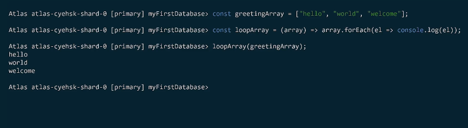
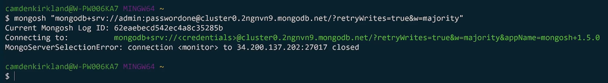
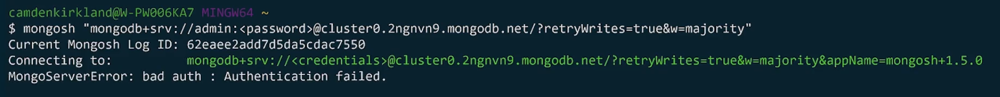

mongodb connection string allows us to connect to the db/server/cluster
includes host+options

standard format and dns seed list format

standard format is used to connect to standalone clusters,replica sets,sharded clusters

dns seed list ни позволява да подадем списък с DNS адресите на сървърите в connection string-a

Organization -> Project -> Cluster -> Connect

    mongodb+srv://<username>:<password>@cluster0.usqsf.mongodb.net/?retryWrites=true&w=majority

mongdodb - показва ,че това е mongodb connection string

+srv опцията автоматично сетва TLS на true и казва на монго да използва dns seed list

<username>:<password> - username и парола за базата ,ако не са подадени се подразбира admin user-a

@cluster0.usqsf.mongodb.net - хостът и port-ът на базата,ако порта не е споменат ще се използва 27017

?... - опции

Connect with Mongo shell:
mongosh "mongodb+srv://mdb-training-cluster.swnn5.mongodb.net/myFirstDatabase" --apiVersion 1 --username MDBUser

Connect your application:
mongodb+srv://MDBUser:<password>@mdb-training-cluster.swnn5.mongodb.net/myFirstDatabase?retryWrites=true&w=majority

Connect using MongoDB Compass:
mongodb+srv://MDBUser:<password>@mdb-training-cluster.swnn5.mongodb.net/test

mongosh is NodeJS REPL среда, което означава, че в shell-a можем да дефинираме променливи,функции и т.н.

MongoDB драйверите свързват нашия app с базата посредством connection string

Troubleshoot network access errors and user authentication errors:

Ако публичното ip на машината от която искаме да се connect-нем не присъства в Network Access -> IpAccessList-a в Atlas:

Ако паролата е грешна или сме подали адрес на друга база в connection string-a:
