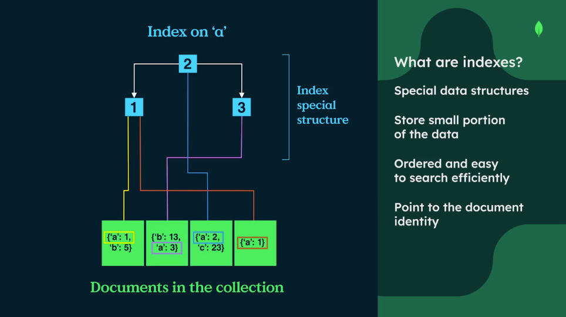
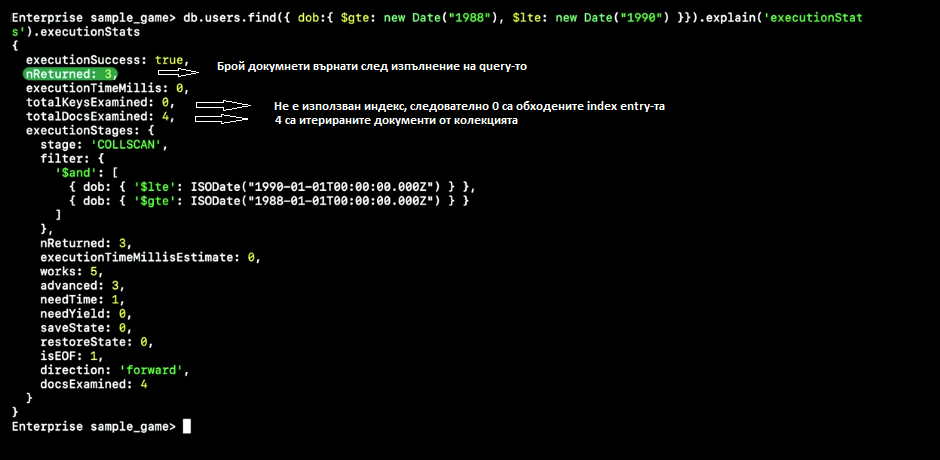
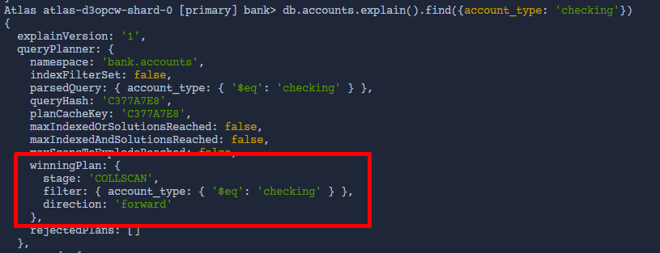
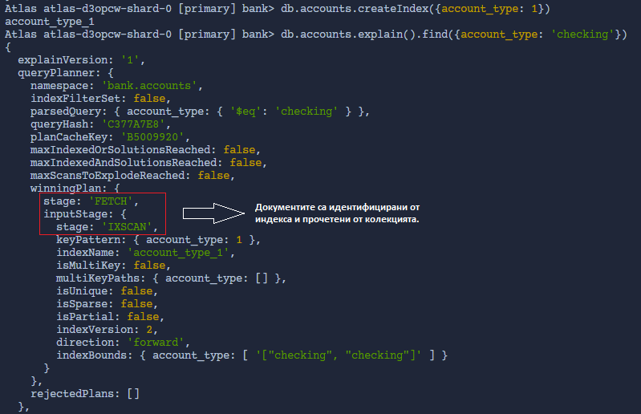
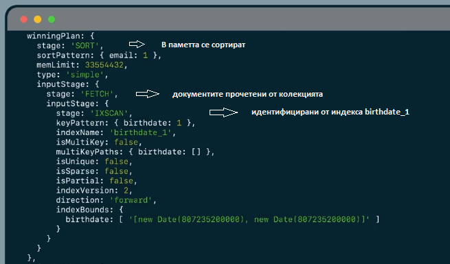
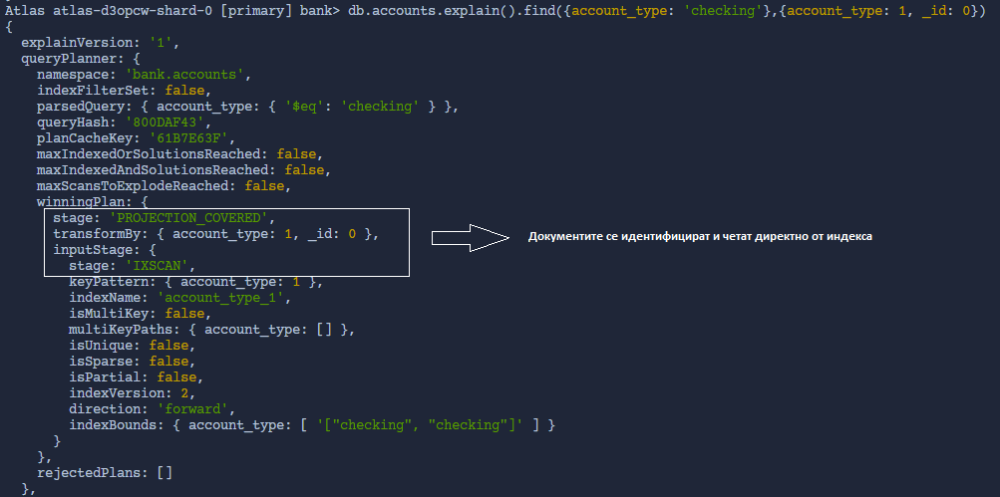
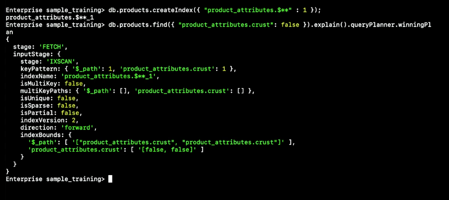
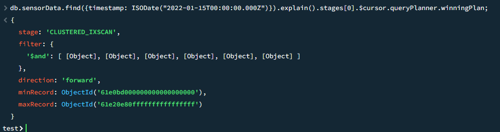
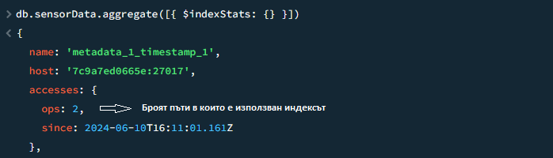

###  За какво служат индексите в mongodb?
Index-ите в монго намаляват времето за намирането на документи:
- при заявки търсещи по конкретни стойности за дадени полета (equality matches)
- при заявки търсещи по range от стойности за дадени полета (range queries)

Index-ите също могат да намалят времето за сортиране, избягвайки in-memory sort.

Индексите са структури от данни, които за всеки индексиран документ пазят стойностите на индексираните полета и референция(_id) към съответния документ.
Индексите са реализирани чрез B-tree (self balancing tree),което означава че записите в индексите са сортирани, което прави търсенете бързо.Търсенето,добавянето и изтриването на елемент от индекса има O(lgn) сложност.

Индексите работят за equality и range-based queries(и др.) и връщат сортиран резултат.

Без употребата на индекс, монго изчита всички документи в колекцията за да провери дали
мачват условието в заявката(collection scan).Тази операция има линейна сложност.
Също ако заявката иска резултатът в сортиран ред, сортирането става в паммета,което изисква 
допълнителни ресурси.

Общо казано, индексите подобравят performance-a при търсене, за сметка на performance при записване.По тази причина 
употребата на индекси е препоръчителна при често изпълнявани заявки за търсене или не толкова често изпълнявани,но тежки
откъм ресурси заявки.

При употребата на индекс, монго връща само документите идентифицирани от индекса на база условието в заявката.
Ако индексът съдържа цялата информация,която заявката иска да вземе ,монго не е нужно да чете от колекцията.

За всяка колекция има един дефолтен индекс,включващ само _id полето.

Когато добавяме нов документ или ъпдейтваме индексирано поле във вече съществуващ документ, трябва да ъпдейтнем и индекса.

###  Какъв може да бъде ефектът ако имаме много индекси?
write perf. може да деградира ако имаме прекалено много индекси за дадена колекция,поради което
трябва да изтриваме неизползвани и redundant индекси

###  Видове индекси
### Single field indexes - индекси върху едно поле
### Compound indexes - индекси върху множество от полета

multikey index - индекс работещ с array поле

Ако имаме customer колекция и често изпълняваме следните query-та:

    db.customers.find({active: true})
    db.customer.find({active: true, accounts: 276258})

Добра идея е да дефинираме индекс включващ active и account полетата,за да подобрим perf. на тези query-та:

    db.customers.createIndex({ active: 1, accounts: 1 });

###  Как се създава single field индекс?

    db.users.createIndex({ email: 1 }); //create index on email field, ordered in ASC order
    db.users.createIndex({ email: 1 }, {unique: true}); //при опит за insert на doc със съществуващ email ще получим duplicate key error
    db.users.createIndex({ email: -1 }); //ordered in DESC order

ASC индекси могат да се използват както за ASC така и за DESC сортиране,като подребата е от значение за compound индексите.

###  Как се list-ват всички индекси дефинирани за дадена колекция?
    db.customers.getIndexes() //get indexes defined for the collection

Response:

    [ { v: 2, key: { _id: 1 }, name: '_id_' } ]
###  Как се проверява дали дадено query използва index?
    db.customers.explain().find({birthdate: {$gt: ISODate("1995-08-01")}})

explain метода връща query plan/execution plan, който съдържа winningPlan изобразяващ stage-овете, които са изпълнени при извикване на заявката.

explain може да се използва с find(),findAndModify(),findOneAndDelete(),findOneAndReplace(),findOneAndUpdate(),update(),mapReduce(),aggregate().distinct(),count(),remove()

Syntax:

    db.collection.explain() //предпочитан синтаксис,защото позволята chaining query modifiers
    db.collection.find().explain() //връща документ,от който можем да извлечем конкретно поле

    db.collection.find({timestamp: {$gt: 2}, isActivated:true}).explain().queryPlanner.winningPlan

explain method verbosity modes: 
    - queryPlanner
    - executionStats
    - allPlansExecution

- nReturned показва броя документи върнати от query-то.Ако този брой отговаря на броя examined documents and keys значи индекса работи оптимално.В противен случай индексът може да се оптимизира.

- totalDocsExamined броят на итерирани документи в следствие на query-то

- totalKeysExamined броят итерирани entry-та в индекса

 Когато explain метода се използва с write операция, mongo връща информация за операцията, но не модифицира базата! 

###  Кои са възможните stage-ове в winningPlan?

IXSCAN - заявката използва индекс

COLLSCAN - заявката не използва индекс,а прави collection scan

FETCH - идентифицираните от индекса документи са прочетени колекцията

SORT - документите се сортират в паметта

PROJECTION_COVERED - индикира,че query-то е fully covered от index-а

####  Winning plan на заявка непокрита от индекс:

####  Winning plan на заявка използваща индекс, но не е напълно покрита от него:

Друг пример:

    db.users.createIndex({ birthdate: 1 })
    db.customers.explain().find({birthdate: {$gt: ISODate("1995-08-01")}}).sort({email: 1})

####  Winning plan на заявка изцяло покрита от индекс:
Ако с projection заявим само полета покрити от index, FETCH stage-а няма да е нужен,защото цялата информация ще бъде върната от индеска:

    db.users.createIndex({ birthdate: 1, email: 1 })

###   Какво е multikey index?
Индекс ,в който едно от индексираните полета е масив.
Само едно от индексираните полета може да е масив.
За всяка стойност от масива има отделно entry в индекса.
Заявка използваща multikey index неизменно включва FETCH stage.

###   Какво е compound index?
Индекс върху повече от едно поле.
Първото поле в дефиницията на индекса се нарича prefix.Независимо къде е позиционирано това поле в дадено query, то ще бъде обработено първо.Заявки, които не използват prefix полето не могат да използват индекса.
Когато дефинираме списъскът с полета в compound index,на първо място поставяме полето тествано за equality match,последвано от полетата използвани за sort и range.
Sort order-a също има значение за избягването на in memory sorts.

Ако заявката използва полета в projection-a ,които не се използват за филтрация или сортиране ,тези полета могат да бъдат добавени в края на списъка с полета при създаването на индекса.

###   Как се изтрива index?

    db.customers.dropIndexes() //изтрива всички индекси с изключение на default-ния индекс върху _id
    db.collection.dropIndexes(['index1name', 'index2name', 'index3name'])     
    db.customers.dropIndex('active_1_birthdate_-1_name_1') //изтрива индекс по име
    db.customers.dropIndex({active:1,birthdate:-1,name:1}) //изтрива индекс по ключове

###   Как се скрива index?
Ако искаме да оценим impact-a от евентуалното изтриване на index, можем да го скрием ,като по този начин mongo няма да го използва в query-та, но ще продължи да го ъпдейтва.
Unhide-ването на иденкс е много по-бързо от неговото пресъздаване.

    db.customers.hideIndex({email:1})

### Force mongo to use specific index

    db.users.find({dob: { $gte: new Date("1988"), $lte: new Date("1990") },inactive: false,})
            .hint({dob: 1, inactive: 1})
            .explain("executionStats").executionStats

###  Какво e wildcard index?
Index, който поддържа queries against unknown or arbitrary fields.
Подходящ е за datasets с dynamic schemas.

Create index on all fields in each document of a collection(usefull if you have very dynamic documents): db.products.createIndex({"$**" : 1})

Wildcard projection:
By default wildcard indexes do not index _id field. If we want to index it and exclude other fields we should use "db.products.createIndex({"$**" : 1}, { "wildcardProjection": {"_id": 1, "stock": 0,"price": 0})"

###  Какво e partial index?
Index, който индексира само документи отговарящи на дадено условие.
MongoDB recommends partial indexes over sparse indexes.

    db.zips.createIndex({ pop: 1 }, { partialFilterExpression: { state: "NY" } });

###  Какво e sparse index?
Index, който индексира само документи съдържащи посоченото поле.
2D,2Dsphere,GeoHaystack and Wildcard type indexes are sparse by default.

    db.sparseExample.createIndex({ avatar_url: 1 }, { sparse: true })
    db.sparseExample.find({ avatar_url: { $exists: true } })
    db.sparseExample.find({ avatar_url: { $exists: true } }).explain("executionStats").executionStats

###  Какво e clustered index?
Clustered index е част от clustered колекция и може да бъде създаден само при нейното създаване.
Clustered колекция пази документите в cluster index order. Cluster index key-я се пази заедно с документите.
Non-clustered колекции пазят документите в случаен ред и index-ите също се съхраняват отделно.

Improved CRUD performance.
Improved query efficiency.
Reduced disk usage and I/O.
Може да има само един clusterеd index за clustered колекция.
Clustered indexes can't be created in capped collections and can't be hidden.
Clustered index is not automatically used if a suitable secondary index exists.

###  Какво e time series колекция?
Time series колекция е clustered колекция и по дефиниция включва clustered index.
Съдържа time series data - data която се променя с времето, като температура и цена на акции например.
Time series data обикновенно се състои от 3 компонента: time, metadata, measurements(key-value pairs които се променят с времето)

Когато създаваме time series колекция, автоматично се създава clustered index върху timeField полето.

    db.createCollection("sensorData", {
        timeseries: {
            timeField: "timestamp",
            metaField: "metadata", //optional
            granularity: "hours", //optional,default is "seconds"
        },
    })

###  How to monitor indexes?
Use $indexStats aggregation operator:

Use database profiler:
When database profiler is enabled database operations will be recorded in the system.profile capped collection.
If profile level is 1 the profiler will record only slow operations.
If profile level is 2 the profiler will record all operations.

    db.setProfilingLevel(0) //profiler is disabled
    db.setProfilingLevel(1, { slowms: 30 }) //profiler will log all operations taking over 30ms into system.profile collection
    db.setProfilingLevel(2) //all operations will be logged into system.profile collection
