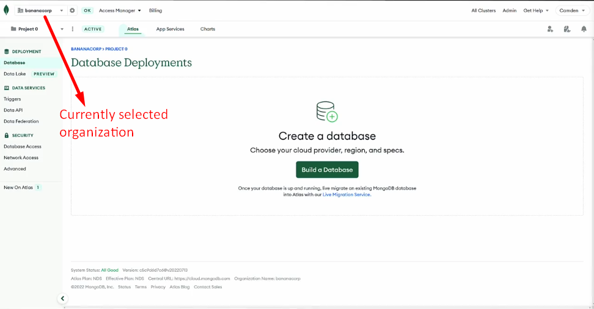

*** In progress ***

1.Set up Atlas account
https://account.mongodb.com/account/login?signedOut=true

2.Deploy an Atlas cluster

3.Use the Data Explorer

Organizations in Atlas allow you to define and group users and teams.
Grant access to projects as well.

Projects allow you to define and organize resources like database clusters.

Create separate projects for dev,test and prod envs.