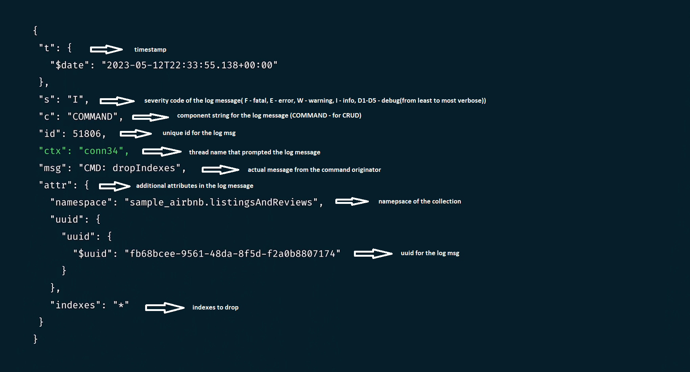

###  Къде се посочва локацията на лог файлa в Монго?
Локацията на лог файла в Монго по подразбиране е /var/log/mongodb/mongod.log ,но може
да бъде променена в /etc/mongod.conf файла под systemLog.path или 
чрез подаване на --logpath аргумента при стартиране на mongod процеса ("ps aux | grep mongod" може да покаже неговата стойност).

//C:\Program Files\MongoDB\Server\<version>\log\mongod.log - windows location

**systemLog.destination: file** - пише във файл

**systemLog.destination: syslog** - пише във linux syslog-a (/var/log/syslog)

**systemLog.destination:** - пише в stdout

Логовете са в JSON формат.

COMMAND компонента посочва че log msg-a е свързан с CRUD операция

CONTROL посочка OS level warning, който може да афектра монго

ACCESS посочва неуспешни операции поради липса на authorization

REPL индикира за msg генериран по време на replication

ELECTION индикира за msg генериран по време на primary node election

###  Как се четат логове от mongosh?
Get available log filters/tags that mongo uses to group messages by name:

###  Как се прочитат последните n записа от log file през mongo shell-a?

    db.adminCommand( { getLog: "global" } ).log.slice(-10)
        или
    var logs = db.adminCommand( { getLog: "global" } );
    logs.log.slice(-10)

###  Как да разследваме бавни операции през mongod лог файла?
Чрез slowms property-то може да зададем време отвъд което операция се счита за бавна. Default-ната стойност е 100ms.

slowms property-то може да се зададе по 3 начина:

    - Чрез --slowms параметъра при стартиране на монго процеса
    - Чрез db.setProfilingLevel(0, {slowms:30}) в mongosh
    - Чрез добавяне на slowOpsThreshold property-то в configuration файл

    sudo grep "Slow query" /var/log/mongodb/mongod.log | jq

###  За какво служи log level verbosity-то?
Чрез verbosity level-a можем да регулираме количеството логвана информация за всеки компонент.
По default е 0, за да спестим disk space. -> Логват се само FATAL ERRORS,WARNING and INFO msgs.

    db.adminCommand({ getParameter: 1, logLevel: 1 }) //get current verbosity level

###  Как глобално да set-нем log level-a?

    db.getLogComponents().index;
    db.setLogLevel(1);
    db.getLogComponents().index;

Change conf file(requires restart):

След промянва на verbosity-то в mongod.conf файла трябва да рестартираме mongodb сървиса.

    sudo systemctl restart mongod

###  Как да set-нем verbosity level-a за конкретен компонент?

    db.setLogLevel(verbosity, component) //сетва глобално и не изисква рестарт, не работи за Atlas clusters
    
    db.getLogComponents().index;
    db.setLogLevel(1, "index");
    db.getLogComponents().index;

    db.getProfilingStatus();
    db.setProfilingLevel(0, { slowms: 20 });
    db.getProfilingStatus();

След промянва на verbosity-то в mongod.conf файла трябва да рестартираме mongodb сървиса.

    sudo systemctl restart mongod

###  Как работят log rotation-a и log retention-a в монго?
log rotation e процесът по редовната подмяна на лог файловете,така че да не достигнат размер затормозяващ системата.
Препоръчително е да се автоматизира на база конкретен размер или времеви период.
Могат да възникнат performance проблеми ако лог файловете и db файловете са разположени на едно място.

Effective log retention involves setting policies for how long logs should be retained, how they should be rotated, and how old log files should be archived or deleted.

За self-managed deployment-и лог файловете се пазят неограничено,освен ако изрично не се упомене да се rotate-ват.
Това става чрез изпращането на SIGUSRР1 сигнал към монго сървиса или чрез изпълняването на db.adminCommand({logRotate:1})

    > mongod -v --logpath /var/log/mongodb/server1.log
    > sudo kill -SIGUSR1 $(pidof mongod) OR > db.adminCommand({logRotate: 1})
        will result in 
    > ls -l
    -rw------- 1 mongod staff 1286 May 15 12:58 server1.log
    -rw------- 1 mongod staff 1286 May 15 12:57 server1.log.2023-05-15T17-57-42

logrotate linux utility can be used for log rotation.It requires mongod.conf file configuration:

Step1:

Step2:
sudo vim /etc/logrotate.d/mongod.conf

Изпраща SIGUSR сигнал всеки ден или когато файлът достигне 10mb

###  Кои са минималните права нужни за сваляне на логове от Atlas cluster?
"Project Data Access Read Only" ролята (GROUP_DATA_ACCESS_READ_ONLY е нейният API еквивалент)

###  За колко дни се пазят логовете в Atlas?
Логовете за всеки сървис(mongod,mongos,mongodbsql) вървящ на клъстъра се пазят за последните 30 дни.

