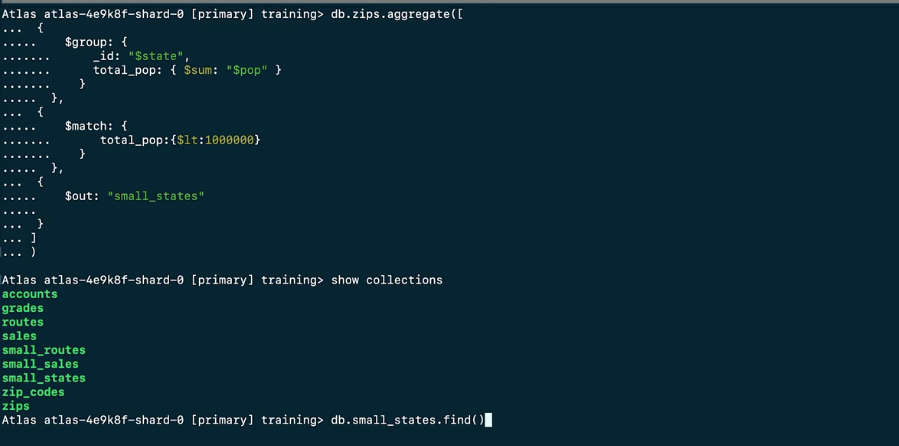

###  Какво са aggregation операциите в MongoDB?
//aggregation is the process of analysing and summarising data
//агрегиране е процес по анализиране и общаване на данни

//Този процес се осъществява чрез aggregation операции.

Aggregation операциите ни позволяват да :
- групираме заедно стойности от множество документи
пример:...
- да изпълняваме операции върху групирана стойност, така че да получим единична стойност
- да анализираме промени по данните във времето

агрегираща операция може да филтрира,сортира,групира,калкулира и трансформира данни

Пример за групиране:

    { "_id": 1, "item": "apple", "price": 10, "quantity": 2 }
    { "_id": 2, "item": "banana", "price": 5, "quantity": 10 }
    { "_id": 3, "item": "apple", "price": 10, "quantity": 5 }

    db.sales.aggregate([
      {
        $group: {
          _id: "$item",
          totalQuantity: { $sum: "$quantity" }
        }
      }
    ])

    [
      { "_id": "apple", "totalQuantity": 7 },
      { "_id": "banana", "totalQuantity": 10 }
    ]

###  Как се изпълнява aggregation операция в MongoDB?
Изпълняват се с помощта на db.collection.aggregate() метода,като синтаксисът е следния:

    db.collection.aggregate([
      {
        $stage1: {
          { expression1 },
          { expression2 }...
        },
        $stage2: {
          { expression1 }...
        }
      }
    ])

aggregate метода приема aggregation pipeline - масив от aggregation stage-ове.
Всеки stage репрезентира една aggregation операция.
Output-ът от всеки stage е input за следващия.

Primer:

    db.orders.aggregate( [
        // Stage 1: Filter pizza order documents to pizzas with a size of medium
        {
            $match: { size: "medium" }
        },
        //резултатът от stage 1 се подава на stage 2
        // Stage 2: Group remaining documents by pizza name and calculate total quantity for each pizza name
        //The total is stored in the totalQuantity field returned by the aggregation pipeline.
        {
            $group: { _id: "$name", totalQuantity: { $sum: "$quantity" } }
        }
    ] )

Примери:
https://www.mongodb.com/docs/manual/core/aggregation-pipeline/#std-label-aggregation-pipeline-examples

###  Основни aggregation операция в MongoDB
$match - връща документите отговарящи на даденото условие 

    db.article.aggregate([
        { $match : { <query> } }
    ]);

Пример:

    { "_id" : ObjectId("512bc95fe835e68f199c8686"), "author" : "dave", "score" : 80, "views" : 100 }
    { "_id" : ObjectId("512bc962e835e68f199c8687"), "author" : "dave", "score" : 85, "views" : 521 }
    { "_id" : ObjectId("55f5a192d4bede9ac365b257"), "author" : "ahn", "score" : 60, "views" : 1000 }
    { "_id" : ObjectId("55f5a192d4bede9ac365b258"), "author" : "li", "score" : 55, "views" : 5000 }
    { "_id" : ObjectId("55f5a1d3d4bede9ac365b259"), "author" : "annT", "score" : 60, "views" : 50 }
    { "_id" : ObjectId("55f5a1d3d4bede9ac365b25a"), "author" : "li", "score" : 94, "views" : 999 }
    { "_id" : ObjectId("55f5a1d3d4bede9ac365b25b"), "author" : "ty", "score" : 95, "views" : 1000 }

    //The following operation:
    db.articles.aggregate(
        [ { $match : { author : "dave" } } ]
    );

    //returns:
    { "_id" : ObjectId("512bc95fe835e68f199c8686"), "author" : "dave", "score" : 80, "views" : 100 }
    { "_id" : ObjectId("512bc962e835e68f199c8687"), "author" : "dave", "score" : 85, "views" : 521 }
    
    db.article.aggregate(
        { $match : { score  : { $gt : 50, $lte : 90 } } }
    );

Препоръчително е $match да се поставя възможно най-рано в pipeline-a, тъй като 
намалява броя документи върху, които да се изпълняват следващите операции в aggr
pipeline-a и съответно се намалява времето за обработка и използваните 
системни ресурси $match също като find() може да използва index-и

$group - връща по един документ за всяка уникална стойност на "групиращия ключ".
Групиращият ключ включва едно или повече полета и може да бъде резултат от expression.
Group key-я се задава като стойност на _id полето в aggregation stage-a,чрез field reference
accumulator-a показва как да агрегираме данните за всяка от групите

    {
        $group: {
            _id: <expression>, // Group key
            <field1>: { <aggregation accumulator1> : <expression1> },
            ...
        }
    }

Пример:

    db.sales.insertMany([
    { "_id" : 1, "item" : "abc", "price" : Decimal128("10"), "quantity" : Int32("2"), "date" : ISODate("2014-03-01T08:00:00Z") },
    { "_id" : 2, "item" : "jkl", "price" : Decimal128("20"), "quantity" : Int32("1"), "date" : ISODate("2014-03-01T09:00:00Z") },
    { "_id" : 3, "item" : "xyz", "price" : Decimal128("5"), "quantity" : Int32( "10"), "date" : ISODate("2014-03-15T09:00:00Z") },
    { "_id" : 4, "item" : "xyz", "price" : Decimal128("5"), "quantity" :  Int32("20") , "date" : ISODate("2014-04-04T11:21:39.736Z") },
    { "_id" : 5, "item" : "abc", "price" : Decimal128("10"), "quantity" : Int32("10") , "date" : ISODate("2014-04-04T21:23:13.331Z") },
    { "_id" : 6, "item" : "def", "price" : Decimal128("7.5"), "quantity": Int32("5" ) , "date" : ISODate("2015-06-04T05:08:13Z") },
    { "_id" : 7, "item" : "def", "price" : Decimal128("7.5"), "quantity": Int32("10") , "date" : ISODate("2015-09-10T08:43:00Z") },
    { "_id" : 8, "item" : "abc", "price" : Decimal128("10"), "quantity" : Int32("5" ) , "date" : ISODate("2016-02-06T20:20:13Z") },
    ])

-Counter the number of all docs in the collection:

    db.sales.aggregate([ 
    {
        $group: {
            _id: null,
            count: {$count: {}}
        }
    }])

Above is similar to SELECT COUNT(*) AS count FROM sales in SQL

Returns:

    { "_id" : null, "count" : 8 }

-Групирай по уникални стойности за item и сумирай quantity-то за всяка група

    db.sales.aggregate([{$group: {_id: "$item", totalQ: {$sum: "$quantity"}}}])

-groups documents by the item field, calculating the total sale amount per item and returning only the items with total sale amount greater than or equal to 100:

    db.sales.aggregate(
        [
            // First Stage
            {
                $group :
                {
                    _id : "$item",
                    totalSaleAmount: { $sum: { $multiply: [ "$price", "$quantity" ] } }
                }
                },
                // Second Stage
                {
                    $match: { "totalSaleAmount": { $gte: 100 } 
                }
            }
        ]
    )

    { "_id" : "abc", "totalSaleAmount" : Decimal128("170") }
    { "_id" : "xyz", "totalSaleAmount" : Decimal128("150") }
    { "_id" : "def", "totalSaleAmount" : Decimal128("112.5") }

This aggregation operation is equivalent to the following SQL statement:

    SELECT item,
    Sum(( price * quantity )) AS totalSaleAmount
    FROM   sales
    GROUP  BY item
    HAVING totalSaleAmount >= 100

More examples:
https://www.mongodb.com/docs/manual/reference/operator/aggregation/group/

===========
$sort и $limit аггр. stage-овете могат да бъдат използвани за намиране на 
най-малки и най-големи стойности в dataset

    db.zips.aggregate([
      {
       $sort: { pop: -1 }
      },
      {
        $limit:  5
      }
    ])

$project aggr operation-a определя полетата които ще бъдат включени в документите върнати в резултата от 
aggr pipeline-a, и също като $set може да създава или променя стойности за нови и съществуващи полета

    {
        $project: {
            state:1,
            zip:1,
            population:"$pop",
            _id:0
        }
    }

$set добавя или модифицира полета в документите върнати от pipeline-a

    {
        $set: {
            place: {
            $concat:["$city",",","$state"]
            },
            pop:10000,
            class: "bird"
        }
    }

$count stage-a връща документ с броя на документите получени до този момент в pipeline-a

    {
        $count: "total_zips"
    }

$out aggregation stage-a създава нова колекция с резултата от операцията или презаписва съществуваща. Трябва да е последен stage в aggr 
pipeline-a. Ако подадените като параметри база и колекция не съществуват - те се създават.Ако не подадем база
като параметър, използва се базата от aggregate метода.

