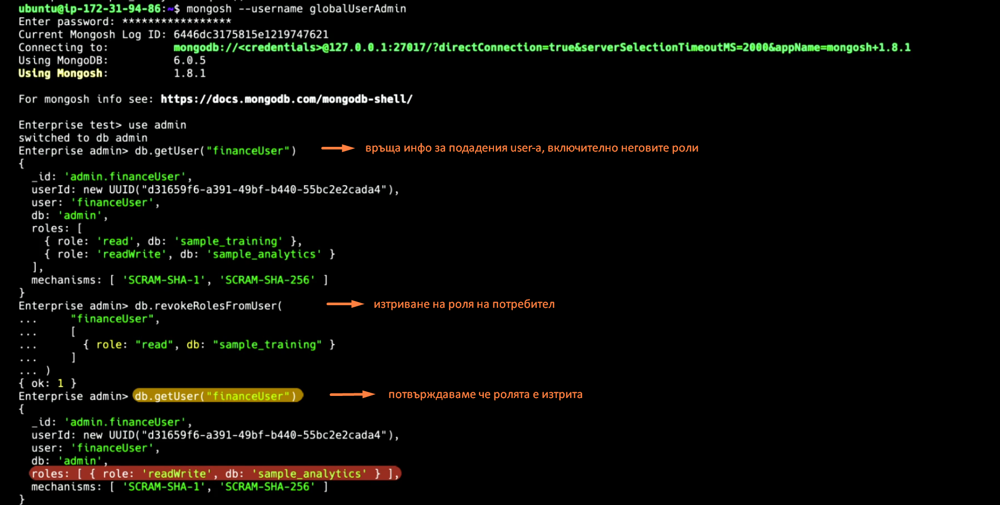

authentication - the process of identifying the user trying to access the database

create login credentials for users that need to connect to db

common auth mechanism - prompt for username and password

auth can be managed by the db itself or through integration with organization identity mgmt system

authorization - процесът по верифициране ,че даден user има права да изпълни определена операция

RBAC(role-based access control) - authorization approach, where permissions are granted to roles rather than to users.
Then users are granted one or more roles.

auditing - logging the changes made to the data and db configuration,as well as security incidents.Add overhead to the system.

Default auth mechanism in MongoDB is SCRAM (salted challenge response authentication mechanism)

Как да създадем user в mongo using SCRAM?
1.mongod process is started and mongosh is installed
2.Enable access control from conf file to enforce authentication
```sudo vi /etc/mongod.conf```

    #security
    security:
        authorization: enabled

```sudo systemctl restart mongod```

3.Connect to mongod with ```mongosh```. Успяваме благодарение на т.нар. localhost exception.
За да можем да създаваме user-и и да им добавяме роли първо трябва да създадем admin user-a в admin базата.


userAdminAnyDatabase - вградена super user роля, която позволява на user-a да създава и модифицира user-и и роли


Localhost exception - позволява да се свържем с localhost без аутентикация стига все още да не са създадени user-и и роли

### <span style="color:darkgoldenrod">Настройване на authorization чрез Role Based Access Control.
Добавяне на роля към потребител при неговото създаване:


Изтриване роля на потребител:


Example built-in roles:
- db user roles:read,readWrite
- db admin roles: dbAdmin, dbOwner
- all-db roles: readAnyDatabase, userAdminAnyDatabase


### <span style="color:darkgoldenrod">Как да актвираме auditing?
- Добавяйки --auditDestination опцията при стартиране на mongod.
- Сетвайки auditLog.destination опцията в config файла.

Можем да записваме audit event-и в:
- syslog-a в JSON формат (не е налична на Windows)
- конзолата в JSON формат
- файл в JSON или BSON формат


    auditLog:
        destination: file
        format: JSON
        path: /var/log/mongodb/auditLog.json


### <span style="color:darkgoldenrod">Какво е encryption?
Encoding data to ensure only permitted users can read it.

Encryption categories:
- transport encryption(network encryption) - данните предавани по мрежата са encrypt-нати, което ги предпазва от interception and tampering during transit.TLS е криптографски протокол, пример за transport encryption.
Mongo поддържа TLS за енкриптване на комуникацията между клиентите и монго инстанциите(data in motion)
За да използва TLS, монго трябва да има TLS сертификат(issued by certificate authority или self-signed cert),верифициращ identity-то на сървъра.

- encryption at rest - процесът по енкриптване на данните съхранявани в базата.
Ако криптиращият данните ключ бъде изгубен или откраднат, данните могат да станат компреметирани или недостъпни.
Също encryption at rest не работи срещу вътрешни заплахи-от(insider attacks) вече оторизирани user-и.
Също не може да защити вече декриптираните данни по време на обработка в RAM паметта.

- in-use encryption - предпазва от insider attacks, криптивайки данните изпращани от client app-a към базата (CSFLE/ client-side field level encryption). Така данните заредени в РАМ паммета също са криптирани.
Данните се криптират и декриптират в client app-a, server-a работи само с криптирани данни.

Със CSFLE можем да криптираме отделни полета в документ.По този нячин те няма да бъдат expose-нати в plain text по време на query lifecycle-a

