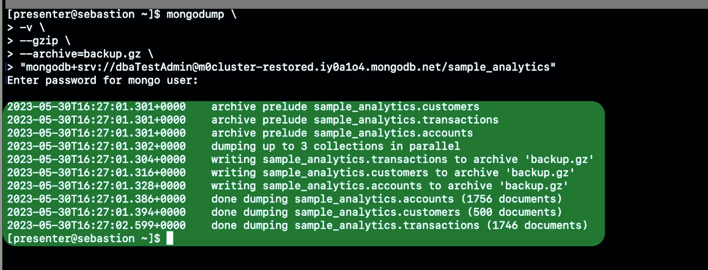
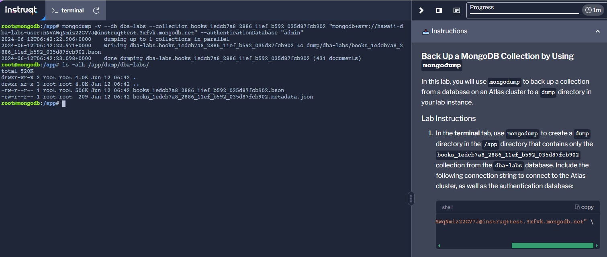
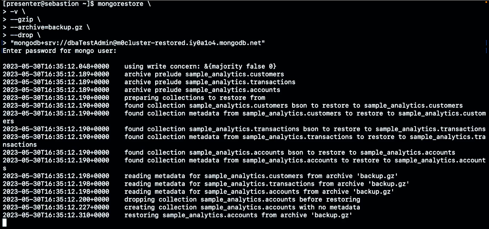
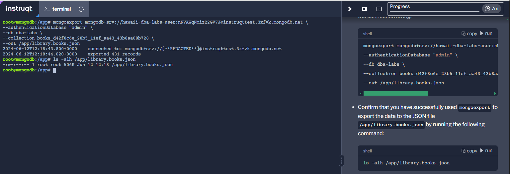
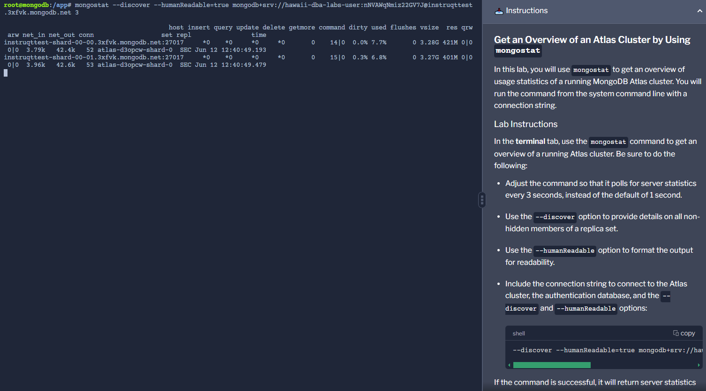

###  Как работи mongodump?
mongodump е подходящ за backup на малки Atlas cluster-и и self-managed MongoDB deployment.

Подходящ за трансфер на малки бази и/или колекции от един cluster в друг.

Пази backup-ите в dump дир на working директорията,в BSON формат.

Не е удачен за backup и recovery на големи бази.

Може да се използва на standalone и replica sets, но не трябва да се използва на sharded clusters.
mongo dump не пази index data.

При повторно стартиране след прекъсване на процеса НЕ продължава от там докъде е стигнал.Също като mongorestore.

Ограничена поддръжка за point-in-time restores.(mongorestore)

За prod. backup and recovery се препоръчва MongoDB Atlas/Cloud Manager/OpsManager

!Важно е mongodump, както и другите монго database utility-та да са от версия съвместима с тази на базата

    mongodump <options> <connection-string>
mongodump options:

    --out //change output dir from dump to other
    
    --db //backup single db instead whole cluster
    
    --collection //backup single collection within a db
    
    --readPreference //backup from secondary node to reduce pressure on primary,risk of stale data
    
    --gzip //compress the data
    
    --archive //archive the otherwise set of files into a single file
    
    --oplog //captures incoming write operations during the backup phase,works only for entire cluster backup

Пример:

Backup only the grades collection from the sample_training database:

    mongodump --db sample_training --collection grades
        или
    mongodump --collection grades "mongodb+srv://dbaTestAdmin@m0-example-cluster.iy0a1o4.mongodb.net/sample_training"

Пример:

###  Как работи mongorestore?
mongorestore налива данни от dump направен с mongodump, в cluster

source и target clusters трябва да са от compatible версии, ако искаме да предотвратим data loss

mongorestore трябва да е compatible с версията на mongodump създала dump-a ,който искаме да restore-нем

mongorestore не ъпдейтва matching документи,само insert-ва новите

mongorestore не restore-ва system.profile колекцията

can trigger index builds, which are time and resource consuming

restore role recommended when auth is enabled

dbAdmin or dbAdminAnyDatabase role is required if backup data includes system.profile collection or if oplogReplay option is used

mongorestore <options> <connection-string> <directory or file to restore>
mongorestore options:

    --nsInclude and --nxExclude gives us control over the namespaces we want to restore

	--drop - removes matching collections from target db before reloading them.Restored docs will get a new _id
	
	--noIndexRestore - skip index generations
	--writeConcern -controls the durability requirements for the restore (default is majority)
	
	--gzip - tells mongorestore that the source data is compressed by mongodump
	--archive - tells mongorestore to use the given filename as the singular source of data instead of a directory
	--oplogReplay - applies oplog data to the target after restoring the source documents

Пример:

The following command:

 - Restores all of the databases running on the cluster at the URI "mongodb+srv://dbaTestAdmin@cluster1.xwgj1.mongodb.net/" from a file called backup.gz
 - Unzips the file by using --gzip
 - Drops any existing data before restoring the cluster with the data in the file

Пример:
Restore only the grades collection from the sample_training database from a dump directory:

    mongorestore --nsInclude=sample_training.grades dump

###  Как работи mongoexport?
mongoexport is a command-line tool that produces a JSON or CSV export of data stored in a MongoDB instance.

export data from mongo collection(BSON format) to a json or csv file

can be used on stanalone,replica set,sharded cluster deployments

type information can be lost during the conversion process,so it is recommended
export to json in canonical mode to preserve BSON data types

FIELD NAMES STARTING WTH $ or CONTAINING . are not supported by mongoimport and mongoexport

--collection - which collection to export //required

--type - export format (default is JSON v2.0 relaxed format)

--out - file to write the exported data

--jsonFormat - level of type fidelity for the exported document.Relaxed and canonical modes.With relaxed mode BSON types are mapped to less restricted JSON types.Canonical mode preserves BSON data types.Relaxed is default.

--query - filters the document to be exported 

    mongoexport --collection=grades --db=sample_training --out=grades.json

###  Как работи mongoimport?
The mongoimport utility is used to restore an existing database with data from a CSV or JSON file.

mongoimport - used to migrate data from other systems into mongodb.Works only with URF-8 encoded files

works with JSON,CSV,TSV

mongoimport should match the version of mongoexport used to produce the file

mongoimport uses batching to efficiently load data. Max batch size is 100 000 bulk insert/upsert operations

FIELD NAMES STARTING WTH $ or CONTAINING . are not supported by mongoimport and mongoexport

Import data to a collection called grades in the students database from a file named grades.json, and replace documents in the database that match the documents in the import file:

    mongoimport --collection=grades --db=students --mode=upsert --file=grades.json

With --mode=upsert, mongoimport replaces existing documents in the database that match a document in the import file with the document from the import file.

###  Как работи mongostat?
mongostat is a diagnostic tool that provides a real-time view of a currently running MongoDB instance.

This command will show the insert rate, query rate, and command rate of the cluster at mongodb+srv://username@businesscluster.iy0a1o4.mongodb.net

    mongostat -o='host,opcounters.insert.rate()=Insert Rate,opcounters.query.rate()=Query Rate,opcounters.command.rate()=Command Rate' "mongodb+srv://username@businesscluster.iy0a1o4.mongodb.net" 2

###  Как работи mongotop?
The mongotop utility tracks the amount of time a MongoDB instance spends reading and writing data per collection.

Show the read and write activity of ar MongoDB instance at mongodb+srv://username@businesscluster.iy0a1o4.mongodb.net every 30 seconds:

    mongotop 30 --uri='mongodb+srv://username@businesscluster.iy0a1o4.mongodb.net'

###  Как работи bsondump?
bsondump конвертира bson files в human readable формат като JSON

This command will create a prettified JSON file from the grades.bson file:

    bsondump --outFile=grades.json -–pretty grades.bson

###  Какво е mongofiles?
mongofiles is a utility that enables you to manipulate files stored in your MongoDB instance in GridFS objects from the command line.

This command will output a list of files in the grades database's GridFS collection that start with the word "final":

    mongofiles -d=grades list final